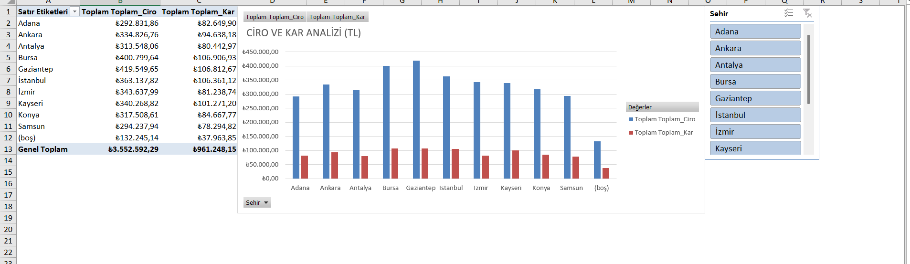
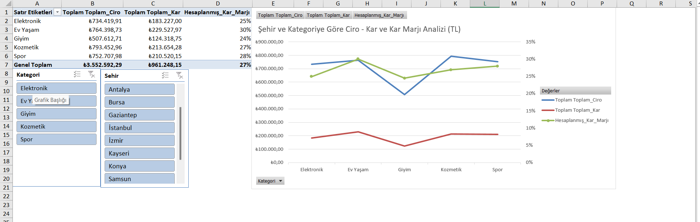
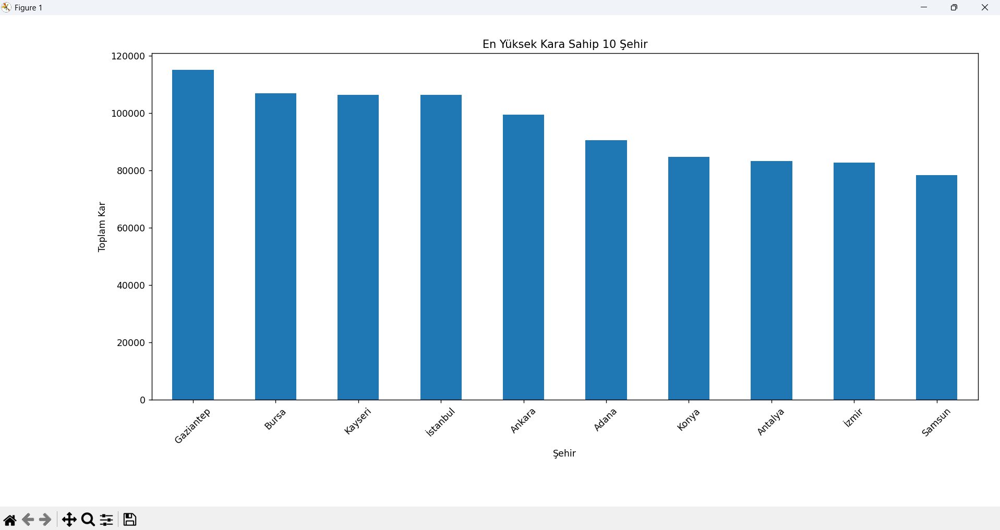
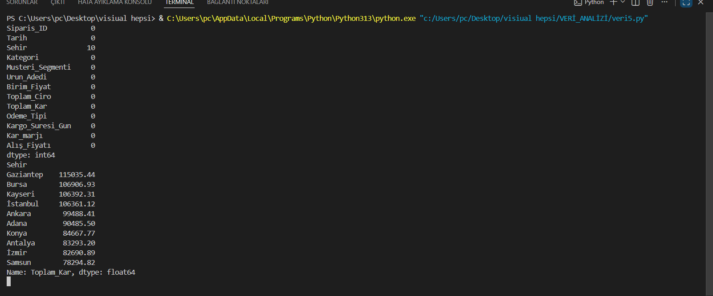

VERİ ANALİZİ PROJESİ
 Bu projede bir satış veri seti analiz edilerek şehir bazlı, kategori bazlı ve toplam kâra göre en yüksek performans gösteren 10 şehir incelenmiştir. 
 Analiz sürecinde Excel, Power BI ve Python kullanılarak veriler görselleştirilmiş ve elde edilen sonuçlar yorumlanmıştır.
 
 
 KULLANILAN TEKNOLOJİLER:
 -EXCEL
 -POWER BI
 -PYTHON
 -PANDAS
 -MATPLOTLİB

 

 ANALİZ SONUÇLARI:
 -Şehir Bazlı;
   Adana Antalya Konya Samsun illeri büyükşehir olmalarına rağmen toplam kâr ve toplam ciro bakımından ortalamanın gerisinde olduğu görülüyor.
   Bu şehirlerde ki mağazlarımızda raf düzeni kontrol edilip (birlikte kullanılabilecek eşyalar yan yana dizilebilir) ürünlerimizin stok 
   durumu takip edilebilir.Gerekirse birlikte kullanılacak ürünlerde geçerli ikinci ürün olana bir miktar indirim yapılabilir. (bu indirim oranı
   öncelikle hesaplanmalı)Diğer şehirlerde ise kargo teslim süresine dikkat edilip stok durumları takip edilmelidir.Bu şehirlerde mağaza yoğunluğuna
   göre çalışan alma durumu yapılabilir.(Müşteriye ilgi alaka seviyesinin yüksek olması müşteriyi memnun eder)

   

-Kategori Bazlı;  (Burada yapılan ortalama değerler mağazanın kendi içerisinde ki kategori ortalamasının analizini bildirmektedir.)
 Bursa,İstanbul,İzmir, illerinde giyim kategorisi ortalamanın çok çok gerisinde olduğu gözlemlenmiştir.Bunun için önemli bir tedbir alınıp stok durumu
 ve defolu ürünler takibe alınmalıdır.
 Genel tabloya baktığımızda giyim kategorisi ortalamanın çok altında olduğu incelenmiştir buna ek olarak fiyatlar da indirime gidilebilir kampanyalar yapılabilir
 kargo ücretleri şirket tarafından karşılanabilir.

 İzmir ve Kayseri illerinde elektronik ürün kategorisi ortalamanın yukarısındadır.Diğer illerimizde ise bu durum tam tersidir.Bunun  için diğer illerimizde garanti
 kapsamı dışında ilk tamir işlemi ücretsiz kampanyası yapılırsa ortalamaya daha yakın bir  ciro elde edilebilir.Başka bir seçenek olarak alınan ürünlerin özelliğine 
 göre ikinci bir güç kablosu hediye edilebilir(Kâr durumu göz önüne alınarak bu işlem gerçekleştirilebilir)

 Büyükşehirler de(Gaziantep Bursa Samsun hariç) bulunan mağazalarımız da kozmetik  ve spor kategorisi  ortalamanın çok altında olup ciddi bir önlem alınması gereklidir.
 Samsun,Kayseri illerimizde ev yaşam kategorisi ortalamanın çok altındadır.Bunun iyileşmesi için kargo firmasıyla irtibata geçilip daha iyi taşımacılık faaliyeti göstermeleri
 hakkında konuşulur.

 

 Toplam Kâra Göre En Yüksek 10 Şehir;
 Python ile veri seti analiz edilirken öncelikle Excel dosyası head() fonksiyonu ile kontrol edilerek veri yapısı incelenmiştir.
 Ardından isnull() fonksiyonu ile eksik veriler analiz edilmiştir.
 Son olarak groupby() kullanılarak şehir bazında toplam kâr hesaplanmış ve en yüksek kâra sahip 10 şehir görselleştirilmiştir.
 İlk 10 içerisinde yer alan şehirlerde mevcut satış stratejilerinin korunması, stok takibinin düzenli yapılması ve müşteri memnuniyetinin ön planda tutulması önemlidir. Özellikle yüksek kâr elde edilen şehirlerde stok yetersizliği yaşanmaması için talep tahminlerinin düzenli olarak güncellenmesi önerilmektedir.
 Bununla birlikte ilk 10 dışında kalan şehirlerde başarılı şehirlerde uygulanan kampanya ve satış stratejileri örnek alınarak kârlılık artırılabilir.

 
 
